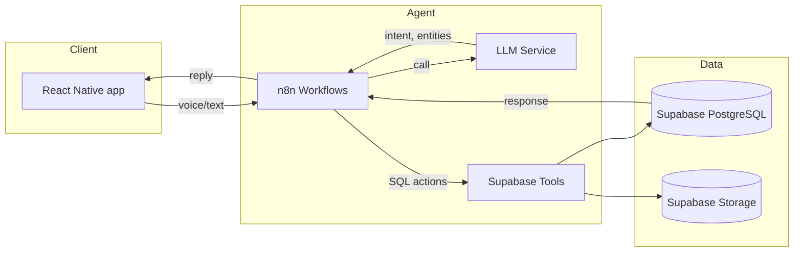
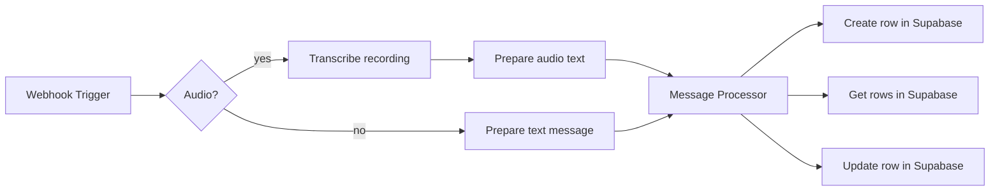

# Lendly – Local-Language Lend–Borrow Manager

Lendly helps users record, update, and view personal lend–borrow (udhaar) transactions through simple chat or voice.  
The workflow automates speech transcription, intent handling, and data updates in Supabase — all orchestrated through **n8n**.  
A companion **React Native** app provides a familiar messaging interface and a calendar to review daily transactions.

---

## How it works

### 🧩 Workflow overview
Incoming messages or recordings from the mobile app are sent to an n8n webhook.  
The workflow then decides whether to transcribe audio or process text directly, routes the message through a reasoning step, and performs the necessary database action in Supabase.




### Nodes

| Node                         | Purpose                                                                              |
| ---------------------------- | ------------------------------------------------------------------------------------ |
| **Webhook**                  | Entry point for chat or audio requests from the mobile app                           |
| **If**                       | Checks if payload contains audio or plain text                                       |
| **Transcribe Recording**     | Uses *Gemini Speech API* to convert audio to text                                    |
| **Audio/Msg Found**          | Normalizes text message for AI processing                                            |
| **AI Agent**                 | Core logic node that interprets the message and decides the right database operation |
| **Google Gemini Chat Model** | Provides natural language understanding and intent extraction                        |
| **Simple Memory**            | Maintains short-term conversation context for sequential requests                    |
| **Supabase Nodes**           | Securely perform `CREATE`, `READ`, or `UPDATE` actions on transactions               |

### React Native App

Features:

Chat-style interface supporting both voice and text input

Automatic transcription and transaction logging

Calendar tab for viewing transactions by date

Inline editing and confirmation before saving

Built-in balance summaries and transaction history

### Database Schema (Supabase)

transactions
```
id uuid primary key,
user_id uuid,
contact_name text,
direction text,      -- 'lend' or 'borrow'
amount numeric,
date date,
created_at timestamp default now()
```

Helper tables:

raw_messages – Stores original message data (for audit)

parsed_results – Logs AI parsing and intent extraction results

Additional helper tables log raw messages and parsed results for auditing.  